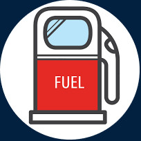

# myFuelProject

# Overview

This project is part of the academic course: Engineering Methods for Software Systems Development.\
The project had been developed by a team of 5 students.\
The project represents software for gas stations management.\
The development of the software has been done in client-server architecture,\
written in JAVA and used MySQL DB.

# Download and Install

1.Download [myFuelServer.jar](https://github.com/NadavShwartz93/myFuelProject/blob/master/jars/myFuelServer.jar).\
2.Download [myFuelClient.jar](https://github.com/NadavShwartz93/myFuelProject/blob/master/jars/myFuelClient.jar).\
3.Download the [myfueldb.zip](https://github.com/NadavShwartz93/myFuelProject/blob/master/dbProjectFiles/myfueldb.zip).\
4.Import the content of the myfueldb.zip to MySQL DB with the schema name: “myfueldb”.\
5.Open myFuelServer.jar and insert the password to the DB and click login.

.

6.Select user from user table in DB.\
7.Open myFuelClient.jar and insert the userName and the password of the selected user and click login.

.

# Credit - Team Members:
[Boaz Trauthwein](https://github.com/BoazTrauthwein)\
[Michael Eliasof](https://github.com/elisofm)\
[Nadav Schwarz](https://github.com/NadavShwartz93) (I am)\
Tal Zilberman and Reham Abbas.
